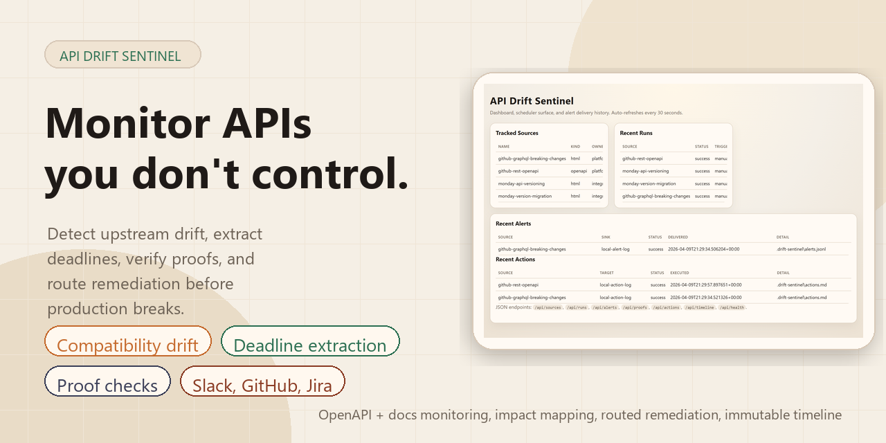
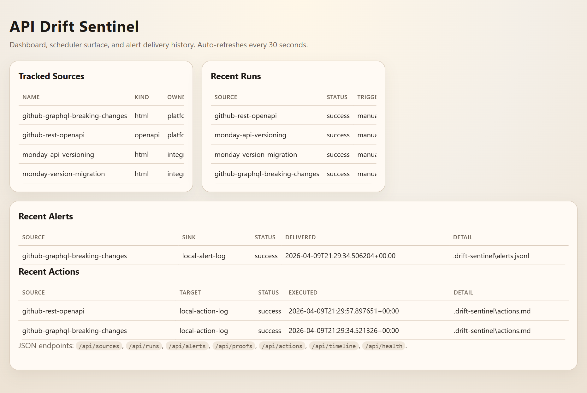
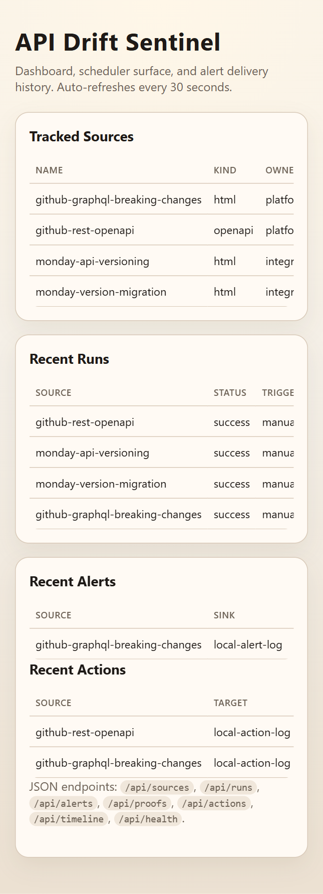
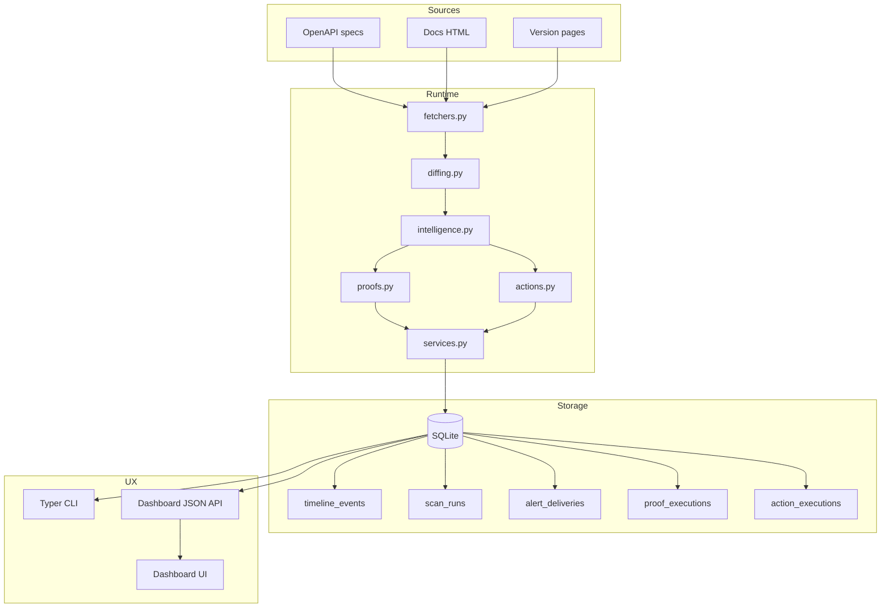
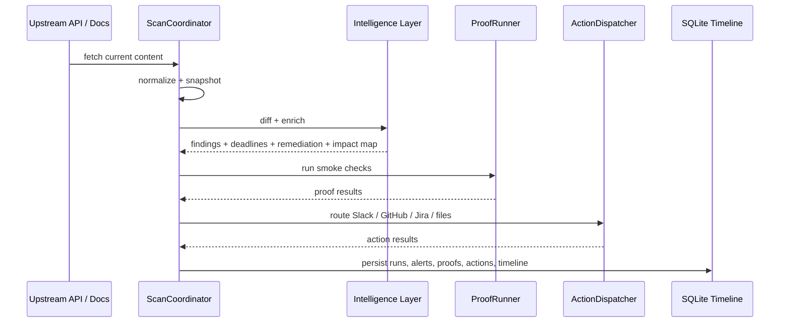
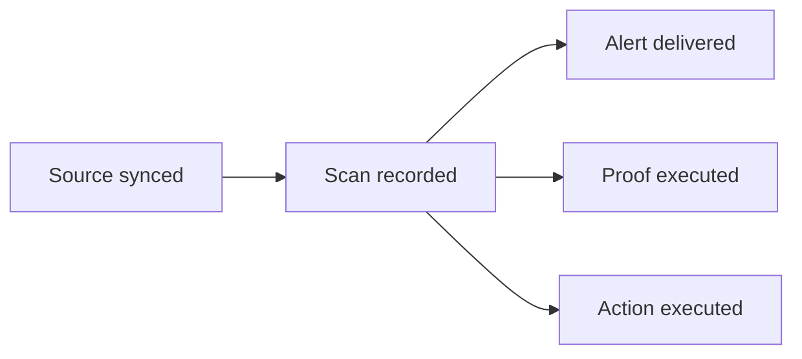

# API Drift Sentinel

[](https://www.python.org/)
[](#quick-start)
[](#compliance-and-audit-timeline)
[](#why-this-project-exists)

*Catch upstream API changes before they break production.* API Drift Sentinel is a tool that monitors external APIs you depend on, not APIs you own: aimed at teams consuming third-party APIs; SaaS integration teams, agencies, internal platform teams, and AI/agent builders that need early warning before an upstream contract shift breaks production. <br>
Featuring integration risk monitoring AKA upstream API change monitoring, API Drift Sentinel watches OpenAPI descriptions and developer docs, detects compatibility drift, extracts deadlines, maps changes to owners and internal services, runs proof checks, and creates routed follow-up actions such as Slack alerts, GitHub issues, Jira tickets, and audit timeline entries.

## Product Preview



Desktop dashboard:



Mobile dashboard:

<p align="center">
  
</p>

## Why This Project Exists

Most integration failures are not outages. They are quiet upstream changes:

- a required parameter gets added
- a response shape loses a field you rely on
- a version sunset date appears in docs
- a migration guide changes wording and nobody notices
- an SDK keeps compiling while the real API contract drifts

API Drift Sentinel turns that into an operational workflow:

1. Detect the change.
2. Rank the urgency.
3. Map it to owners, repos, services, and customer-facing workflows.
4. Prove whether the change matters.
5. Open routed work and keep an immutable audit trail.

## Illustrated Overview

```mermaid
flowchart LR
    A[External Sources<br/>OpenAPI / Docs / Changelogs] --> B[Normalization Layer]
    B --> C[Compatibility Engine]
    C --> D[Deadline + Vendor Intelligence]
    D --> E[Noise Control<br/>focus / suppress / baseline]
    E --> F[Impact Mapping<br/>owners / repos / runbooks]
    F --> G[Proof Checks<br/>command / http / sample schema]
    G --> H[Actions<br/>Slack / GitHub / Jira / webhooks / files]
    H --> I[SQLite Timeline + Dashboard]
```



## What It Does

### Detection

- Fetches `openapi` and `html` sources.
- Normalizes them into stable snapshots.
- Stores every snapshot in SQLite.
- Compares current vs previous payloads with a semantic compatibility engine.

### Intelligence

- Extracts migration deadlines, deprecation dates, effective-on dates, and sunset signals from docs.
- Infers vendor-aware remediation for GitHub and monday.com out of the box, with generic enrichment for other vendors.
- Maps sources to:
  - internal services
  - repos
  - owners
  - runbooks
  - customer-facing workflows

### Control

- Focus only on endpoints or schema paths that matter.
- Suppress known-noisy findings.
- Baseline accepted drift without losing the event history.
- Set per-source severity thresholds.

### Proof

- Run command smoke tests.
- Call live HTTP endpoints.
- Validate sample payloads against normalized OpenAPI request/response schemas.

### Action

- Send alerts through console, file, or generic webhook sinks.
- Open routed actions through:
  - Slack webhooks
  - GitHub issues
  - Jira issues
  - generic webhooks
  - local worklog files

### Auditability

- Persists scan runs, proof executions, alert deliveries, action executions, and append-only timeline events.
- Exposes the data through both a local dashboard and JSON API endpoints.

## Architecture



## Scan-To-Action Workflow



## Feature Matrix

| Layer | Current capability |
| --- | --- |
| Source ingestion | OpenAPI files, JSON/YAML specs, docs HTML pages |
| Diff engine | Operation removal/addition, request narrowing, response widening, header drift, enum/type/property changes |
| Vendor intelligence | GitHub, monday.com, generic |
| Ownership mapping | Services, repos, owners, runbooks, customer workflows |
| Deadline awareness | Deprecation dates, migration deadlines, effective-on and sunset-style signals from docs |
| Proofs | `command`, `http`, `sample_schema` |
| Alerts | console, file, generic webhook |
| Action outputs | file worklog, webhook, Slack webhook, GitHub issue, Jira issue |
| Noise control | focus endpoints, focus schema paths, suppression rules, baseline rules, per-source thresholds |
| Auditability | immutable timeline for scans, alerts, proofs, and actions |
| Interfaces | Typer CLI, HTML dashboard, JSON API |

## Quick Start

```bash
uv sync
uv run drift-sentinel scan --config examples/sources.yaml
uv run drift-sentinel report --source github-rest-openapi
uv run drift-sentinel schedule --config examples/sources.yaml --once
uv run drift-sentinel serve --config examples/sources.yaml --scheduler
```

Module entrypoint:

```bash
uv run python -m api_drift_sentinel scan --config examples/sources.yaml
```

## CLI Commands

| Command | Purpose |
| --- | --- |
| `drift-sentinel init-db` | Create the SQLite schema |
| `drift-sentinel scan` | Run scans and create enriched findings |
| `drift-sentinel history` | Inspect snapshots for one source |
| `drift-sentinel report` | Render a markdown or JSON report |
| `drift-sentinel list-sources` | List tracked sources with impact metadata |
| `drift-sentinel runs` | Show recent scan runs |
| `drift-sentinel alerts` | Show recent alert deliveries |
| `drift-sentinel proofs` | Show recent proof executions |
| `drift-sentinel actions` | Show recent action executions |
| `drift-sentinel timeline` | Show append-only audit history |
| `drift-sentinel schedule` | Run the scheduler once or as a daemon |
| `drift-sentinel serve` | Start the dashboard and JSON API |

## Dashboard And JSON API

The local dashboard serves an HTML status page and machine-readable endpoints:

| Endpoint | Description |
| --- | --- |
| `GET /` | Dashboard UI |
| `GET /api/health` | Liveness check |
| `GET /api/sources` | Source summaries, impact maps, latest run/action/proof |
| `GET /api/runs` | Recent scan runs |
| `GET /api/alerts` | Recent alert deliveries |
| `GET /api/proofs` | Recent proof executions |
| `GET /api/actions` | Recent action executions |
| `GET /api/timeline` | Append-only timeline |
| `GET /api/sources/<name>` | Detailed view for one source |
| `POST /api/scan?source=<name>` | Trigger scans from the dashboard process |

## Example Configuration

The sample config in [examples/sources.yaml](examples/sources.yaml) already includes:

- ownership mapping
- vendor hints
- proof checks
- suppression rules
- routed action targets

Illustrative fragment:

```yaml
actions:
  - name: local-action-log
    kind: file
    target: .drift-sentinel/actions.md
    min_severity: info
    format: markdown

sources:
  - name: github-rest-openapi
    kind: openapi
    url: https://raw.githubusercontent.com/github/rest-api-description/main/descriptions/api.github.com/api.github.com.json
    vendor: github
    impact:
      services: [repo-sync-worker]
      repos: [acme/repo-sync]
      owners: [platform-oncall]
      runbooks: [https://runbooks.example.com/github-rest-api]
      customer_workflows: [repository onboarding]
    proof_checks:
      - name: list-repos-sample
        kind: sample_schema
        operation: GET /user/repos
        status_code: "200"
        content_type: application/json
        sample_payload:
          - id: 1
            name: example
    suppression_rules:
      - name: ignore-next-link-noise
        finding_codes: [response-header-added]
        schema_paths: [response header 200 Link]
        reason: pagination headers are expected churn
    action_target_names: [local-action-log]
```

## Proof Checks

| Kind | Use case |
| --- | --- |
| `command` | Run local smoke tests or SDK probes |
| `http` | Hit live endpoints and validate status/body |
| `sample_schema` | Validate request/response examples against normalized OpenAPI schemas |

This is the “proof, not just inference” layer: if a change is risky, you can immediately attach executable evidence.

## Action Routing

| Target kind | Typical use |
| --- | --- |
| `file` | Local worklog, audit export, or CI artifact |
| `webhook` | Generic automation or incident platform |
| `slack_webhook` | Owner-routed team notifications |
| `github_issue` | Open tracked remediation work in a repo |
| `jira_issue` | Open ops/platform workflow tickets |

Dry-run mode is supported for webhooks, Slack, GitHub, and Jira so you can validate the payloads before turning on live automation.

## Compliance And Audit Timeline

Every important system event is recorded as an append-only timeline item:

- source config synced
- scan recorded
- alert delivered
- proof executed
- action executed



That gives you an answer to:

- what changed
- when it was detected
- who was notified
- what evidence was gathered
- what follow-up action was created

## Differentiation

This project is not trying to be a producer-side API design platform.

Its core position is:

> monitor upstream API and docs risk for consumers of third-party APIs

That means it is optimized for:

- teams consuming vendor APIs
- integration-heavy backends
- customer-facing automations
- AI agents and tool pipelines
- platform groups that need owner routing and auditability

## Testing

```bash
uv sync --extra dev
uv run pytest
```

## Current Limits

- The compatibility engine resolves local OpenAPI refs and covers common structural compatibility rules, but it is not a full formal proof system for every OpenAPI or JSON Schema edge case.
- Deadline extraction from docs is heuristic and strongest where vendors publish explicit dates.
- Vendor-aware enrichment is currently deepest for GitHub and monday.com, with generalized remediation for other vendors.
- The dashboard is intentionally lightweight and local-first rather than a hosted multi-tenant control plane.

## Project Layout

| Path | Responsibility |
| --- | --- |
| `src/api_drift_sentinel/fetchers.py` | source loading and normalization |
| `src/api_drift_sentinel/diffing.py` | semantic compatibility checks |
| `src/api_drift_sentinel/intelligence.py` | vendor enrichment, deadlines, remediation, noise control |
| `src/api_drift_sentinel/proofs.py` | proof execution |
| `src/api_drift_sentinel/actions.py` | routed work creation |
| `src/api_drift_sentinel/storage.py` | SQLite persistence and audit timeline |
| `src/api_drift_sentinel/server.py` | dashboard UI and JSON API |
| `src/api_drift_sentinel/cli.py` | operator-facing commands |

## License

Created and maintained by Andras Gregori @ GregOrigin. This repository includes the MIT license in [LICENSE](LICENSE).
